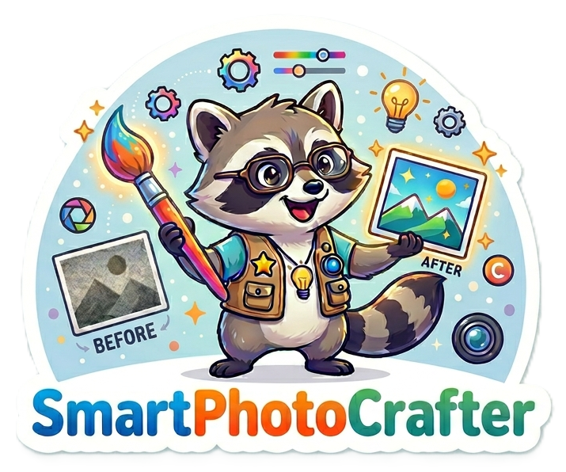
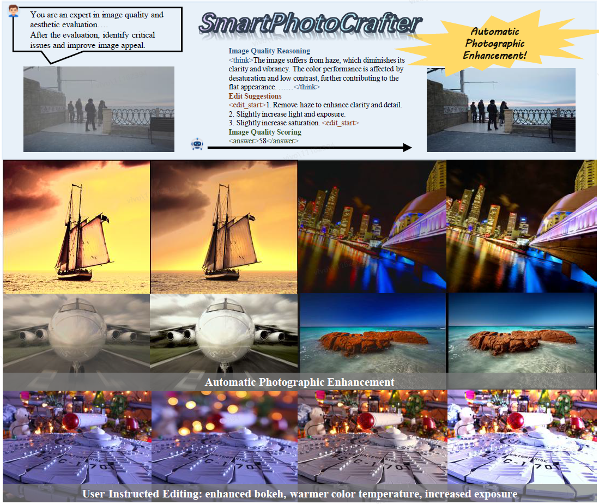

<div align=center>

</div>
<h2 align="center"> 
  SmartPhotoCrafter: Unified Reasoning, Generation and Optimization for Automatic Photographic Image Editing
</h2>


<a href="https://arxiv.org/abs/2604.19587"></a>&nbsp;
<a href="https://vivocameraresearch.github.io/smartphotocrafterweb"></a>&nbsp;
<a href=""></a>&nbsp;
<a href=""></a>&nbsp;
<a href="http://www.apache.org/licenses/LICENSE-2.0"></a>&nbsp;

**SmartPhotoCrafter** is an end-to-end framework for automatic photographic image editing that reformulates traditional editing as a closed-loop reasoning-to-generation process. Unlike prior methods that rely on explicit user instructions, our approach autonomously identifies aesthetic deficiencies, reasons about improvement strategies, and performs targeted edits without human prompts.


## ✨ Highlights 
- **Fully Automatic Editing** – No user instructions or parameters required; the model completes the closed loop of quality assessment → reasoning → editing autonomously.
- **Dual Capability** – Supports both **image restoration** (denoising, deblurring, low-light enhancement) and **image retouching** (color, tone, contrast enhancement).
- **Aesthetic Reasoning** – Explicitly generates image quality analysis and editing suggestions, improving interpretability.
- **High-Fidelity Generation** – Preserves original content structure while delivering photo-realistic outputs with high tonal/color semantic sensitivity.
- **Reinforcement Learning Optimization** – Jointly optimizes reasoning and generation modules, aligning editing trajectories with human aesthetic preferences.

## 🖼️ Demo


## 📣 News 
- **`2026/04/07`**: We open-source the inference scripts.
- **`2026/04/22`**: Our [Paper on ArXiv](https://arxiv.org/abs/2604.19587) is available!

## ✅ To-Do List for SmartPhotoCrafter Release
- ✅ Release the inference code of SmartPhotoCrafter
- [  ]  Release the SmartPhotoCrafter pretrained weights


## Requirements and Installation

### Prepare Environment 
Create a conda environment & install requirements 
```shell
# python==3.10.0 cuda==12.4 torch==2.5
conda create -n smartphotocrafter python==3.10.0
conda activate smartphotocrafter
pip install -r requirements.txt
```

### 📦 Pretrained Model Weights
| Models           | Download |   Features |
|------------------|---------------------------------------------------|---------------------------------------------------------------------------------------------------------------------------|
| SmartPhotoCrafter      | 🤗 [Huggingface]() 🤖 [ModelScope]()         | 
Qwen-Image-Edit-2509 | 🤗 [Huggingface](https://huggingface.co/Qwen/Qwen-Image-Edit-2509) 🤖 [ModelScope](https://www.modelscope.cn/models/Qwen/Qwen-Image-Edit-2509) | Base Model |
 

## 😉 Demo Inference
We provide scripts for both automatic and manual editing. Automatic editing only requires inputting one image, while manual editing requires adding a prompt.

Automatically edit reasoning scripts
```PowerShell
bash scripts/inference/automatic-edit.sh
```

Manual edit reasoning scripts
```PowerShell
bash scripts/inference/manual-eidt.sh
```

Script example
```PowerShell
CUDA_VISIBLE_DEVICES=0 python infer.py \
    --model_path "ckpt/Qwen-Image-Edit-2509" \
    --dit_path "ckpt/DiT.safetensors" \
    --vlm_path "ckpt/text_encoder" \
    --image_path "example/841012.png" \
    --output_folder "example/output/automatic" \
    --seed 42 \
```


## 🚀 Training
Coming Soon ...

## ⭐ Acknowledgement
Our code is modified based on [Edit-R1](https://github.com/PKU-YuanGroup/Edit-R1). We adopt [Qwen-Image-Edit-2509](https://github.com/QwenLM/Qwen-Image) as the base model. 

## 📜 License 
All the materials, including code, checkpoints, and demos, are made available under the [Creative Commons BY-NC-SA 4.0](https://creativecommons.org/licenses/by-nc-sa/4.0/) license. You are free to copy, redistribute, remix, transform, and build upon the project for non-commercial purposes, as long as you give appropriate credit and distribute your contributions under the same license.


## 🎓 Citation

```bibtex

```
